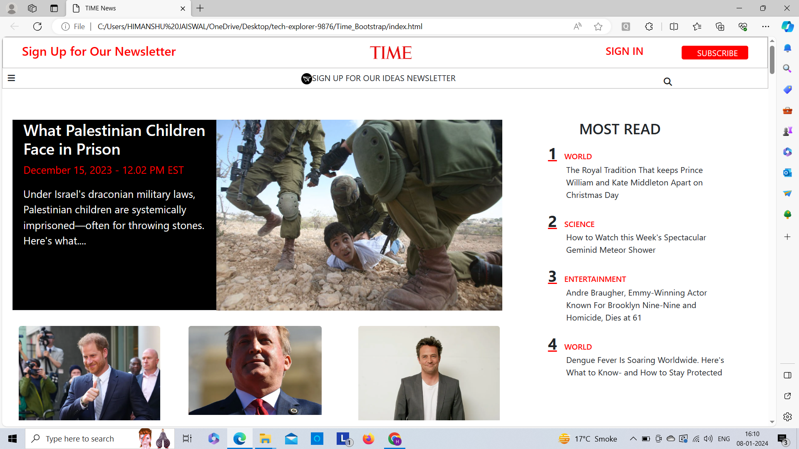

<h1>Project Name : TIMES Page </h1>

Welcome to TIMES clone page repository. This repository hosts the code for a web project that replicates a TIMES page clone during construct week. This project involves cloning and implementing one page of the original website design. This project aims to replicate the design during construct week using HTML, CSS and Bootstrap.

 
<h2>Table of Contents</h2>

<ul> Page Preview</ul>
<ul>Features</ul>
<ul>Tech Stack</ul>
<ul>Contributors</ul>
<h2>Page Preview</h2>

 

 
<h2>Features</h2>

This project replicates the original page to closely match the original layout and aesthetics. The implementation is achieved using HTML, CSS and Bootstrap demonstrating front-end development skills.

 
<h2>Tech Stack</h2>

<ul>HTML</ul>
<ul>CSS</ul>
<ul>Bootstrap</ul>
 
<h2>Contributors</h2>

<ol>Pratham</ol>
<ol>Abhay fw28_176</ol>
<ol>Kusuma</ol>
<ol>Aravindhakshan</ol>
<ol>Himanshu</ol>
 
<h2>Acknowledgements</h2>

We would like to express our gratitude to our project mentor for providing guidance and support throughout the project.

 
<h2>Live Deployed Link</h2>
https://times-news363.netlify.app/

